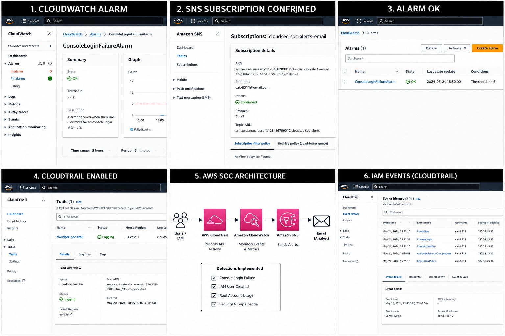

# CloudSec SOC Enterprise Lab

Enterprise SOC + Cloud Security + Detection Engineering laboratory built on AWS.

---

# Project Overview

This project simulates a real-world SOC environment using AWS native security services.

Technologies used:

- AWS CloudTrail
- CloudWatch
- SNS
- IAM
- Detection Engineering
- Security Monitoring
- Incident Response
- SIEM concepts

---

# Detection Rules

| Detection | Status |
|---|---|
| Console Login Failure | Implemented |
| IAM User Created | Implemented |
| Root Account Usage | Implemented |
| Security Group Change | Implemented |

---

# SOC Detection Flow

```text
IAM Events
    ↓
    CloudTrail
        ↓
        CloudWatch
            ↓
            SNS Alerts
                ↓
                SOC Analyst
                ```

                ---

                # Repository Structure

                ```text
                architecture/
                aws/
                detections/
                devsecops/
                incident-response/
                reports/
                screenshots/
                scripts/
                siem/
                ```

                ---

                # MITRE ATT&CK Coverage

                - T1110 - Brute Force
                - T1136 - Create Account
                - T1098 - Account Manipulation

                ---

                # Status

                Implemented

                # CloudSec SOC Enterprise Lab

                AWS SOC/Cloud Security laboratory focused on monitoring, detections and incident visibility using:

                - AWS CloudTrail
                - Amazon CloudWatch
                - Amazon SNS
                - IAM Monitoring
                - Security Event Detection

                # SOC Dashboard

                

                # Implemented Detections

                | Detection | Status |
                |---|---|
                | Console Login Failure | ✅ |
                | IAM User Created | ✅ |
                | Root Account Usage | ✅ |
                | Security Group Change | ✅ |

                # Detection Flow

                IAM Events → CloudTrail → CloudWatch → SNS → Email Alert